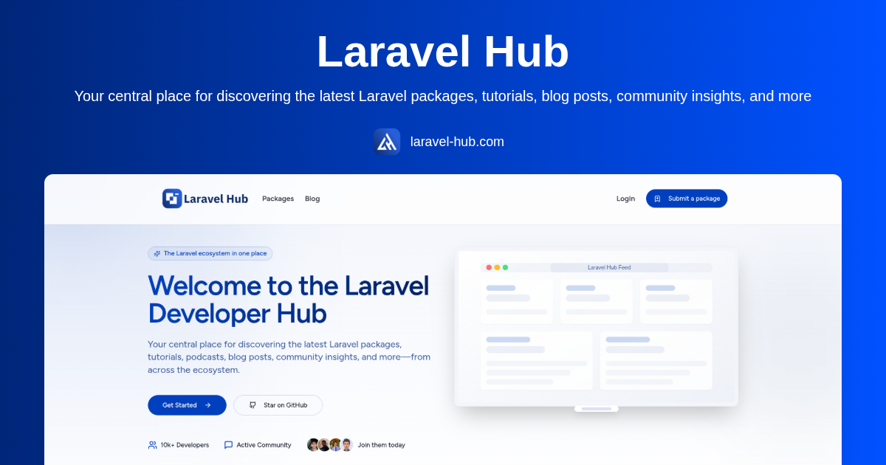

# Laravel Hub – The Central Community for Laravel Developers



**_"From Developers, For Developers."_**  

[Laravel Hub](https://laravel-hub.com) is an open-source platform and community designed to help Laravel developers discover, explore, and contribute to the best packages, blog posts, tools, and resources in the Laravel ecosystem.

Laravel Hub brings together curated content, developer tools, and user-driven posts — all in one central platform for Laravel professionals.

---

## Mission

Our mission at Laravel Hub is to build the most comprehensive and community-focused hub for Laravel developers. We aim to:

- Help developers discover top Laravel & PHP packages  
- Curate high-quality articles, videos, podcasts, and news from trusted sources  
- Give developers a place to publish posts, share knowledge, and grow visibility  
- Enable users to follow topics, bookmark content, and engage in discussions  
- Foster collaboration, learning, and contribution in the Laravel ecosystem  

---

## Features

Laravel Hub is more than a package index — it's a Laravel developer hub. It includes:

- **Package Directory** – Searchable listings of Laravel and PHP packages  
- **Multi-format Post Feed** – Community posts, videos, podcasts, tutorials, tests  
- **User Accounts** – Submit packages and posts, comment, reply, bookmark  
- **Topics & Following** – Follow topics or content types that matter to you  
- **Admin Blogging System** – Markdown-based blog posts for SEO and updates  
- **GitHub Integration** – Fetch data from GitHub repositories with README rendering  
- **Modern UI/UX** – Built for performance and clarity with Tailwind and React  

---

## Tech Stack

Laravel Hub is built with modern, scalable tools:

- **Laravel** – Backend API & data layer  
- **Inertia.js v2** – Laravel + React bridge  
- **React.js + TypeScript** – Interactive and typed frontend  
- **Tailwind CSS + ShadCN UI** – Utility-first design system with prebuilt UI components  
- **MySQL or PostgreSQL** – Flexible database support  
- **GitHub Actions** – Continuous Integration & Formatting  
- **Laravel Breeze / Sanctum** – Authentication & session management  

---

## License

This project is open-source under the **MIT License**.  
Feel free to use, extend, or build on top of it for your projects.

---

## About the Author

**Laravel Hub** is created and maintained by [**Muhammed Elfeqy**](https://github.com/thefeqy), a software engineer focused on Laravel, open-source contribution, and developer tools.

---

## Contributing

We welcome contributions to Laravel Hub from the community.

To contribute:

1. Fork the repository  
2. Create a new branch: `feature/your-feature-name`  
3. Make your changes  
4. **Before committing or pushing**, run the formatter:

```sh
composer run format
````

5. **Ensure all test cases pass**:

```sh
./vendor/bin/phpunit
```

6. Push your branch and open a Pull Request on GitHub

We appreciate your help in building the Laravel Hub platform.

---

## Show Your Support

If you find Laravel Hub helpful:

* Star the repository on GitHub
* Share [laravel-hub.com](https://laravel-hub.com) with fellow developers
* Submit your own packages, tools, or blog posts
* Join the conversation and help shape the Laravel community hub

---

## Contact & Community

* GitHub Issues: [Submit issues or suggestions](https://github.com/laravel-hub/laravel-hub/issues)
* GitHub Discussions: [Join the discussion](https://github.com/laravel-hub/laravel-hub/discussions)
* Twitter/X: [@thelaravelhub](https://twitter.com/thelaravelhub)
* Email: [thefeqy@gmail.com](mailto:thefeqy@gmail.com)

---

**Laravel Hub – Your hub for all Laravel-related things.**
